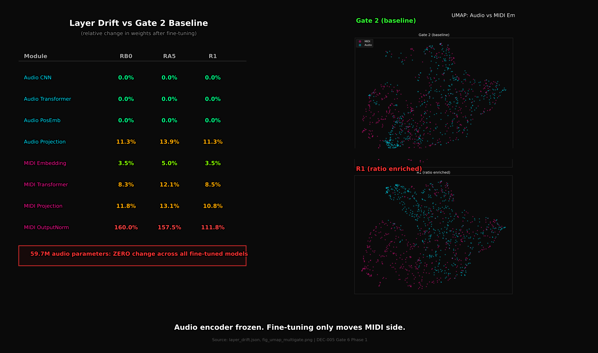

<div align="center">
  
  
  <h1>Phideus</h1>
  <p><strong>A long-horizon program exploring whether frequency-ratio structure can operate as a portable information domain across heterogeneous signals.</strong></p>
  
  <p>
    <a href="https://phideus.com.ar"><strong>Visit the Website: phideus.com.ar</strong></a>
  </p>
</div>

---

## 🌌 Overview
Phideus is framed by **Harmonic Information Theory (HIT)** and studies whether **ratio-based relational structure** can serve as an information layer that transfers across modalities, not just inside one sensor type. Cross-modality deep learning is the operational experiment field, not the conceptual endpoint.

## 🧭 Program Duality
Phideus is intentionally built as a double path. Both paths are coupled: theory defines what to test, and model behavior provides the evidence loop.

1. **Research Path**: Explore whether ratios carry reusable structure and test that claim across modalities with controlled experiments.
2. **AI Model Path**: Design and train models that learn and operate with ratio logic, moving toward ratio-native representations and decision behavior.

## 🌐 What's on the Website
- **Project Thesis & Framework**: An overview of Harmonic Information Theory (HIT) and what we're aiming to achieve.
- **Evidence & Bias Control**: Rigorous documentation of tests, empirical results, and validations of our core hypotheses. Includes our stance against fabricated metrics.
- **Architectures**: Deep dives into the models, mechanisms, and systems being developed to test HIT (e.g., Gate sweeps, Reverse Cross-Attention comparisons).
- **Roadmap & Progress**: The current state of "Escalon 1", the trajectory to "Escalon 2", and investor-relevant milestones.
- **Docs Portal**: Access to scientific papers, experiment setups, and data assets.

## 🚀 Development Quick Start

This project is built with **Vite + React**. 

```bash
# Install dependencies
npm install

# Start the development server
npm run dev

# Build for production
npm run build
```

---
*Built with logic, ratios, and rigorous scientific framing.*
